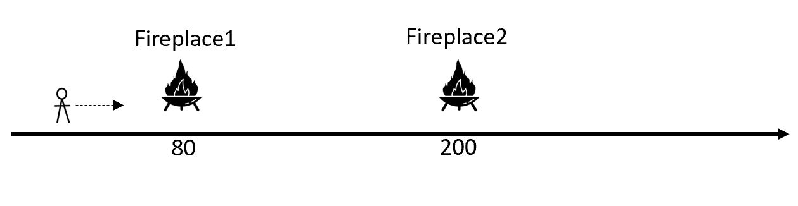
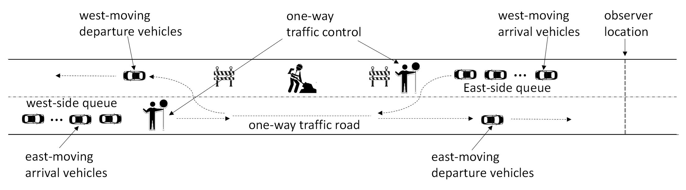

# PF_DA_Tutorial
**Tutorial on Particle Filter-based Data Assimilation for Discrete Simulations**\
**Questions/Comments? Contact [Xiaolin Hu](https://sims.cs.gsu.edu/sims/XiaolinHu.htm)**

This repository incldues the source codes for two tutorial examples. These two examples are deliberately chosen to support stepwise learning. The first example includes a simple and intuitive mobile robot system that is simulated by a discrete time model with underlying continuous state variables. The goal of this example is to demonstrate the overall procedure of particle filter-based data assimilation. The second example includes a more complex one-way traffic control system that is simulated by a discrete event simulation model. This example helps readers to learn how data assimilation can be applied and implemented for complex discrete event systems. 

## Example 1: Mobile Robot with Temperature Sensor Data
Source code of this example is included in the **Tutorial_PF_MobileRobot** directory. 

This example includes a mobile robot moving on a one-dimensional road as shown below. 

The robot carries a temperature sensor that measures the temperature of its location every second. The measurement data is noisy, and is influenced by two fireplaces (called Fireplace1 and Fireplace2) located at two known positions: Fireplace1 is at position 80 (m) and Fireplace2 is at position 200(m). The goal of data assimilation is to estimate the robot’s position and moving speed dynamically based on real-time temperature measurement as the robots moves. 

## Example 2: One-Way Traffic Control System
Source code of this example is included in the **Tutorial_PF_OneWayTraffic** directory. 

We consider a one-way traffic control system that is often used during road construction, as illustrated below. 

During a road construction, the one-way traffic control is managed by two persons deployed to the west and east ends of the one-way traffic road segment. Each person carries a STOP/SLOW hand-held traffic paddle to control the traffic, where the STOP sign means cars should stop and wait, and the SLOW sign means cars can slowly move ahead to pass the road segment. It is assumed that the two persons coordinate and always use the STOP/SLOW signs in opposite directions: when one uses the STOP sign the other would use the SLOW sign. In the following description, we refer to the STOP sign as the red traffic light and the SLOW sign as the green traffic light, and refer to cars' moving directions as east-moving (moving towards east) and west-moving (moving towards west). During the time when the traffic light is green on a specific direction (east-moving or west-moving), the arrival cars moving in the opposite direction would be queued. The queues at the west side and east side of the road segment are named as the west-side queue and east-side queue, respectively.\
\
To ensure construction workers’ safety, only one car is allowed to move on the one-way traffic road at any time. During a green light period, the traffic-control person on the corresponding side would signal a car to move ahead only when the previous car has finished crossing the road segment. The one-way traffic control system uses the following rules to switch traffic lights:
* If the elapsed time for the current moving direction (east-moving or west-moving) has reached a pre-defined threshold (120 seconds in this example) and the opposite moving direction has cars waiting, switch the traffic light. Note: the traffic light switches only after the road segment is cleared if there is a car already moving on the road. 
* If the current moving direction has no car waiting and the opposite moving direction has cars waiting in the queue, switch the traffic light even if the 120-second threshold is not reached.  
* If the current moving direction has cars waiting in the queue and the opposite moving direction has no car waiting, keep the traffic light unswitched even after the 120-second threshold. In this case, the cars on the current moving direction keeps moving forward. 
* If none of the current moving direction and the opposite moving direction has any car needing to cross the road segment, keep the traffic light unswitched. 

The cars at both sides of the road segment arrive randomly and independently, modeled by Poisson distributions. For the east-moving cars, the Poisson distribution has arriving rate λ=1/7 (1 car per 7 seconds). For the west-moving cars, the arriving rate λ=1/10 (1 car per 10 seconds). This means there are more east-moving cars than west-moving cars. The time it takes for a car to cross the one-way traffic road segment is also a random number, modeled by a truncated normal distribution that has mean μ=4.0 (seconds) variance 0.5^2 and lies within the range of [3.0, 5.0].\
\
To collect real-time data from the system, an observer (sensor) is deployed at the location on the east end of the one-way traffic road that is marked as the “observer location” in the above figure. The observer is able to count the number of vehicles moving crossing its location for both the east-moving departure vehicles (named as eastMoving_departure) and west-moving arrival vehicles (named as westMoving_arrival). The observer reports data in every 30 seconds. It does not record the specific time that a vehicle crosses the observation location – all it reports is the number of vehicles that have departed and arrived in the past time interval. The data reported by the observer is noisy.\
\
The goal of data assimilation is to estimate the state of the one-way traffic road in real time based on observation data eastMoving_departure and westMoving_arrival. The state vector includes five state variables: 1) x_phase defines the discrete phase of the road segment (e.g., eastMovGreen_passive, westMovGreen_active); 2) x_sigma is the time remaining in the current phase. This is a non-negative continuous state variable; 3) x_elapsedTimeInGreen keeps track of the elapsed time in the “eastMovGreen” or “westMovGreen” phases. This is a non-negative continuous state variable. The x_elapsedTimeInGreen is reset to zero whenever the traffic light switches; 4) x_eastQueue keeps track of the size of the east-side queue. This is a discrete scalar state variable with non-negative integer values; 5) x_westQueue keeps track of the west-side queue, which is also a discrete scalar state variable with non-negative integer values. None of these state variables can be directly derived from the observation data.

# References
* Hu, Xiaolin. 2023. [Dynamic Data-Driven Simulation: Real-Time Data for Dynamic System Analysis and Prediction](https://www.worldscientific.com/worldscibooks/10.1142/13166#t=aboutBook). Singapore: World Scientific Publishing Co. Pte. Ltd.
* Hu, Xiaolin. 2023. “[A Tutorial on Bayesian Sequential Data Assimilation for Dynamic Data Driven Simulation](https://ieeexplore.ieee.org/document/10155351).” In Proceedings of the 2023 Annual Modeling and Simulation Conference (ANNSIM), 680-695. IEEE.
* Hu, Xiaolin. 2022. “[Data Assimilation for Simulation-Based Real-Time Prediction/Analysis](https://ieeexplore.ieee.org/document/9859329).” In 2022 Annual Modeling and Simulation Conference (ANNSIM), 404-415. IEEE.

